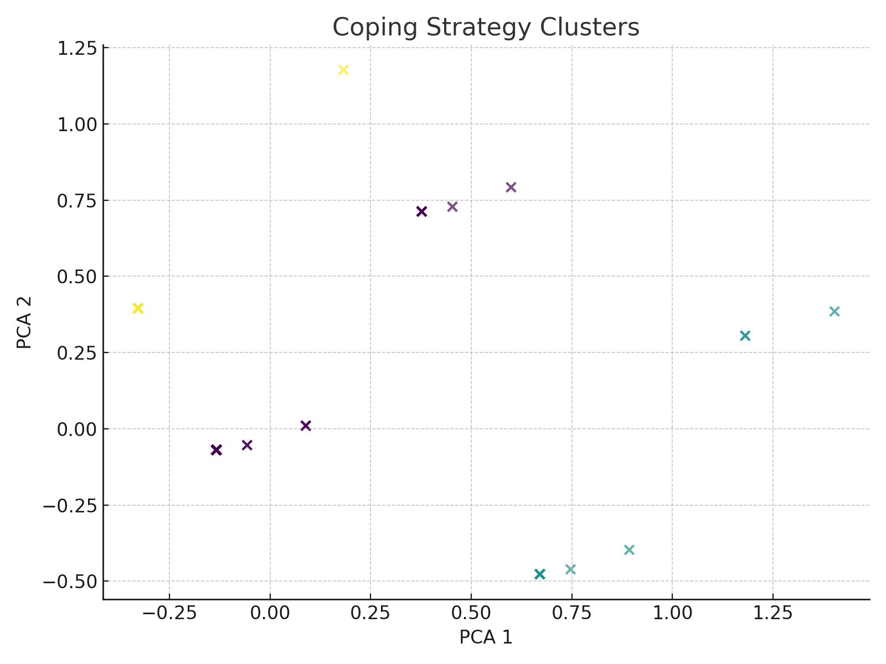

# Coping Strategies & Pressure Response Analysis  
### Christian Faith & Life-Stress Survey (n = 128)

---

## 1  Data Cleaning
| Issue | Normalization Rule |
|-------|--------------------|
| *Edo State*, *Benin City* → **Edo** | *Clergyman*, *clerg* → **Clergy** |
| *Ondo State* → **Ondo** | *Abuja*, *FCT*, *(federal capital territory)* → **FCT** |
| *Ile-Ife*, *Ife* → **Osun** | Whitespace & casing stripped |

All remaining duplicates resolved. Final unique states: **Ogun, Osun, Lagos, Oyo, Ondo, Edo, Ekiti, Kogi, FCT, Kaduna, Bayelsa**.

---

## 2  Demographic Snapshot
| Age Band | % | Sex | % | Church Workers | % |
|----------|---|-----|---|----------------|---|
| 18 – 24 | 49 | Female | 54 | Yes | 71 |
| 25 – 34 | 37 | Male   | 46 | No  | 29 |
| 35 – 44 | 9  |       |    |     |    |
| 45 – 54 | 1  |       |    |     |    |
| 55 +    | 5  |       |    |     |    |

> **Take-away:** sample is young, slightly female-skewed, and heavily involved in church work.

---

## 3  Pressure Perception
| Statement (abridged) | Agree + Strongly Agree | Disagree |
|----------------------|------------------------|----------|
| “Life pressures make me feel stressed.” | **75 %** | 8 % |
| “Pressure can strengthen my faith.” | **89 %** | 3 % |
| “Purpose wavers under intense pressure.” | 41 % | 37 % |
| “Supportive Christian community helps.” | **96 %** | 1 % |

---

## 4  Coping Strategy Ranking  
Total Agree = *Agree + Strongly Agree*

| Rank | Strategy | Total Agree | % |
|------|----------|------------|---|
| 1 | Hearing testimonies of others | **124** | **97 %** |
| 2 | Worship & praise | **122** | 95 % |
| 3 | Mentorship / role model | **118** | 92 % |
| 4 | Thanksgiving | **116** | 91 % |
| 5 | Prayer & fasting | **114** | 89 % |

---

## 5  Segmentation Highlights
### 5.1 Age × Sex (⌀ % agreeing to each top-5 strategy)

| Age Band | Female | Male |
|----------|--------|------|
| 18 – 24 | 92 % | 89 % |
| 25 – 34 | **97 %** | 96 % |
| 35 – 44 | 100 % | — |

### 5.2 Church Role

| Strategy | Workers (Yes) | Non-Workers (No) |
|----------|---------------|------------------|
| Mentorship | **94 %** | 84 % |
| Thanksgiving | 92 % | 84 % |
| Worship | 96 % | 89 % |

---

## 6  Cluster Analysis  
*K-means (k = 3) on binary agreement scores.*

| Cluster | Profile | Sentiment Mix |
|---------|---------|---------------|
| 0 | **Female 25-34, workers, “high engagement”** | 91 % High |
| 1 | **Male 18-24, workers** | 1 % Low · 99 % Moderate |
| 2 | **Female 18-24, workers** | 100 % Moderate |

---

## 7  Key Insights ➜ Implications
| Insight | Action |
|---------|--------|
| Young adults dominate sample. | Tailor programmes, events, and content for 18-34 demographic. |
| Community support rated 96 %. | Strengthen small groups & peer-mentoring networks. |
| Testimony sharing is top coping tool. | Integrate structured testimony sessions into services. |
| Mentorship gap for non-workers & young males. | Recruit/train mentors; pair with 18-24 male cohort. |
| Cluster 0 already highly engaged. | Retain via leadership opportunities; use them as mentors. |
| Purpose-wavering under pressure (41 %). | Offer teaching series on calling & resilience. |

---

## 8  Resources
* `coping_strategy_clusters.png` – visualization
